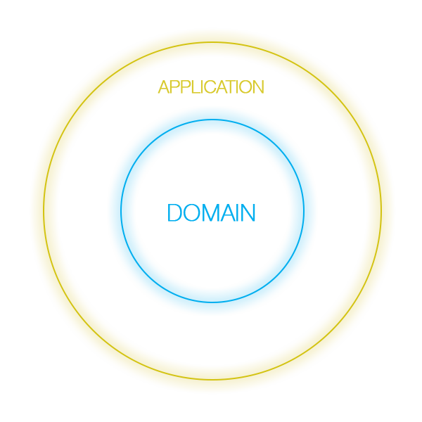

# Laravel on my way

Um projeto modelo de como implementar camadas de serviço em projetos Laravel, sem a utilização de Repository Pattern, 
em qualquer versão do Laravel.

_[Work in progress] Este documento está em construção_

---

## Introdução

Qual a melhor forma de estruturarmos com um projeto Laravel, garantindo o seu crescimento e a sua manutenibilidade?

Essa é uma pergunta comum, quando pensamos em projetos de grande porte. Nesse repositório, exponho uma das abordagens utilizadas 
por mim, em alguns dos projetos Laravel que já trabalhei. 

É importante ressaltar, que não considero a existência de uma maneira correta de trabalhar com o Laravel. A melhor forma, no meu ponto de vista,
é aquela que funciona para o projeto, e para a equipe, fundamentalmente, garantindo a manutenção, extensão, funcionamento e 
segurança do projeto. Logo, então, o que apresento aqui, é algo que atende à essas premissas. 

## O Problema

Laravel é um framework acessível, poderoso, que fornece uma série de ferramentas de fácil manuseio, para que desenvolvedores 
trabalhem no desenvolvimento de suas aplicações. Ele utiliza o padrão MVC (Model View Controller), onde seu model utiliza o 
padrão de design (design pattern) Active Record e é desse ponto que partiremos.

O Active Record é um padrão de design que dá o poder de auto-salvamento a um Model. Entenda como objetos com super poderes.
Cada instância de um objeto Active Record representa um registro do banco de dados, onde as suas propriedades são acessadas 
e modificadas por métodos acessores e modificadores, "escondendo", assim, suas propriedades. Digo, escondendo, entre aspas, 
porque, neste padrão, as propriedades que deveriam estar ocultas, podem ser acessadas de forma direta, magicamente, 
exatamente como acontece com o Laravel, com o Rails, Yii e muitos outros frameworks, porém com poderes de auto-criação, 
destruição e muitos outros.

## As camadas de serviço

Nesse projeto, trabalharemos com serviços. Aqui, serviços herdam conceitos de Service Layer e Domains service do DDD, para que, os serviços
possam ser estruturados de forma que as entidades não possuam regras de negócio e tudo aconteça através de serviços, mas, veja bem, 
não há, aqui, uma implementação profunda e fiel de DDD, embora possuam algumas características dele. Isso acontece, porque podemos escolher
quais abordagens queremos adicionar aos nossos projetos e essas foram as que eu escolhi para aplicar nos projetos que participo.

<p align="center">
    
</p>

Para começarmos com o entendimento da estrutura adotada, este projeto está separado em duas camadas: `camada de domínio` e `camada de aplicacão` e 
considere que, entre elas, há uma barreira imaginária que separa as duas camadas, onde a camada de aplicacão só pode acessar qualquer recurso
na camada de domínio através de um serviço. Tendo isso em mente, fica proibido o acesso direto, por exemplo, a um model, 
 pela camada de aplicação. Logo, para tudo, teremos um serviço, que DEVE garantir que, sempre que um dado persistente seja retornado, por exemplo, 
ao invés de retornar uma instância de um `Model` ou de `LengthAwarePaginator` com uma coleção de models, serão retornados para a camada de 
aplicação, instâncias de POPO's (Plain Old PHP Object), para que somente os dados sejam retornados, ao invés de models emponderados, 
evitando,assim, que dados persistentes sejam manipulados sem o conhecimento de algum serviço. 

Me refiro a evitar que algo desse tipo possa acontecer:

```blade
@foreach($notes as $note)
    <h1>{{ $note->title }}</h1>
    <p>{{ $note->description }}</p>
    <?php $note->delete() ?>
@endforeach
```
Observe o código acima. Considerando que uma view qualquer, que é um serviço de aplicação, possui uma instância do model `Note` e, erroneamente, 
aciona o metodo `delete()` do model, dentro de um laço que deveria estar aprensentado as informações das `notes`.

Separar a aplicação em camadas, e construir uma barreira entre elas, é necessário para que assumamos o controle total sobre os dados
e para evitar, também, que esse tipo de coisa aconteça.

## Definições das camadas

 - *Domain layer:* onde residem os objetos de negócio.
 <br><br>
  Exemplo: 
  
     ```txt
     Domain
        - Models
        - Services
        - Validations
          ...
     ``` 

 - *Application layer:* contém a mecânica da aplicação, faz o direcionamento dos objetos, envia/recebe dados para/do usuário, 
 através de apis, CLI ou interfaces gráficas.
 <br><br>
 Exemplo: 
 
    ```txt
     - Apis
     - GraphQL
     - Front-ends
    ```

 - *Infraestrutura:* camada de apoio e suporte às demais camadas.

## Estrutura de pastas

Para termos um projeto mais organizado, precisamos descontruir um pouco a proposta inicial de um projeto Laravel e aproveitarmos 
algo que também é proposto pelo framework, que é estruturar o seu projeto como você preferir. Então, não há estrutura de pastas correta,
ela só precisa ser coerente pra você e para os demais participantes do desenvolvimento do projeto.

De modo geral, as mudanças aqui serão feitas dentro da pasta `app`. Você pode fazer mudanças fora, também, fique à vontade! Se
entender que é isso que deve ser feito, faça, mas, nesse projeto, as principais mudanças na estrutura de pastas acontecerão dentro da pasta `app`. 

### `App/Core`

Para começar, vamos falar da pasta `app/Core`. 

As pastas `Console`, `Exceptions`, `Http` e `Providers`, que estavam dentro da pasta `app`, foram movidas para `app/Core`. 
Ela vai conter todas as pastas do bootstrap do projeto.

Essa mudança afeta difetamente o framework, já que os arquivos namespaçados foram movidos para uma outra pasta. Logo, 
foram feitas atualizações em todas as chamadas para esses arquivos, para esses arquivos, para resolver o problema com as referências. 

### `App/Domains`

Aqui estão os domínios que estamos trabalhando nesse projeto. No caso, Notes e Users. Dentro dessas pastas possuem os 
modelos todos os serviços relacionados aos modelos.

### `App/Support`

Essa é a camada de infraestrutura, que mencionei anteriormente. Aqui, possuem serviços de apoio aos domínios ou aos
serviços de aplicação. Um serviço da infraestrutura pode ser consumido diretamente por um serviço de aplicação ou por um 
serviço de domínio.

### `App/Applications`

Aqui teremos todas as aplicações do nosso projeto. No nosso caso, só existe uma aplicação chamada API, mas poderiam haver 
outras, como um GraphQL, uma command line ou uma interface gráfica, com views utilizando o próprio blade do Laravel.

Estruturalmente, teriamos algo assim:

```txt
App\Applications/

- Api
    - Http
        - Controllers
    - Providers
    routes.php

- frontend
    - Http
        - Controllers
    - Providers
    - Resources
         - _templates/default.blade.php
         - notes/index.blade.php
           ...
    routes.php
```

## Author

 - Mauricio Rodrigues <mmauricio.vsr@gmail.com> 

## License

MIT
